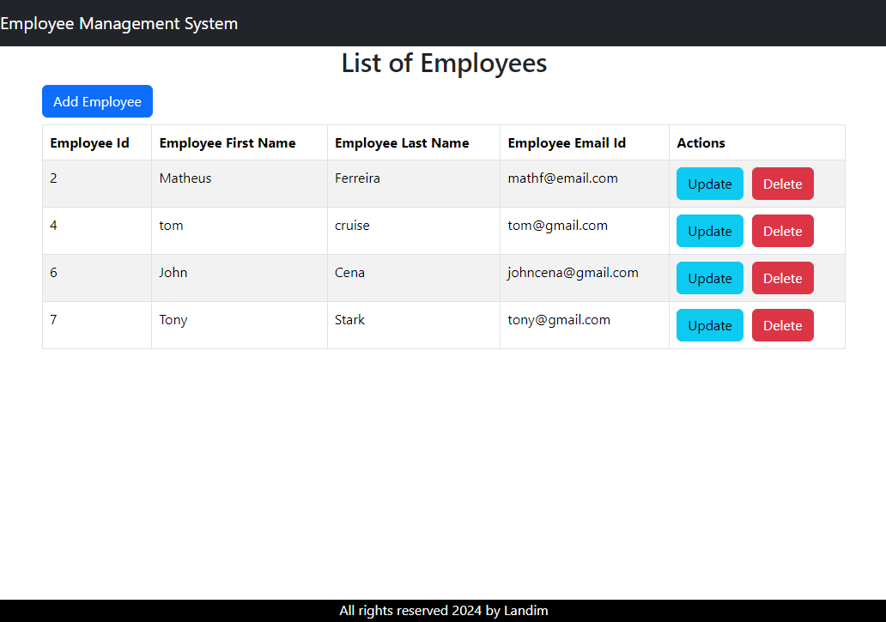

<h2 align="center">
Employee Management System using React  
</h2>

<p align="center">
It's a simple CRUD system using React 
</p>

<p align="center">
  
  <a href="">
    
  </a>
  <a href="">
    
  </a>
</p>

<p align="center">
    
</p>

## Requirements

- Node.js 20.10.0

## Install

```
npm install
```

## Run

```
npm run dev
```
